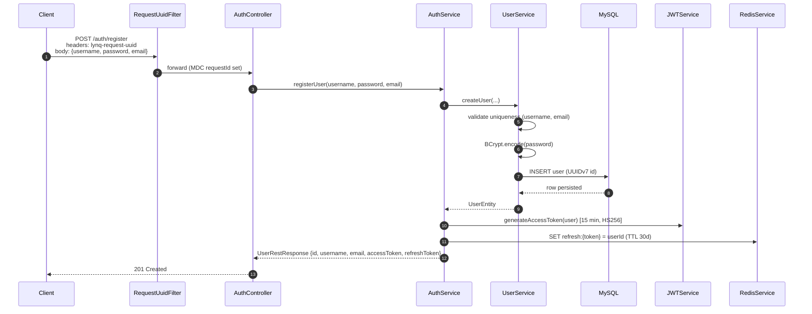
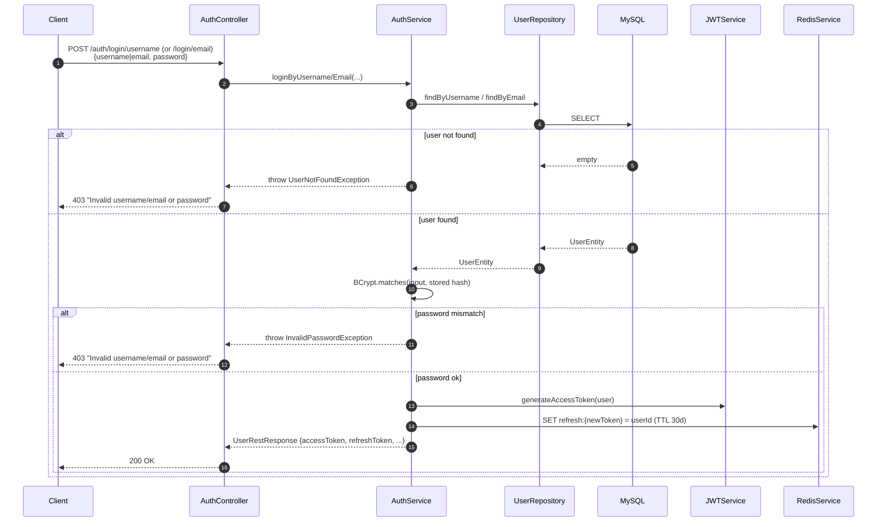
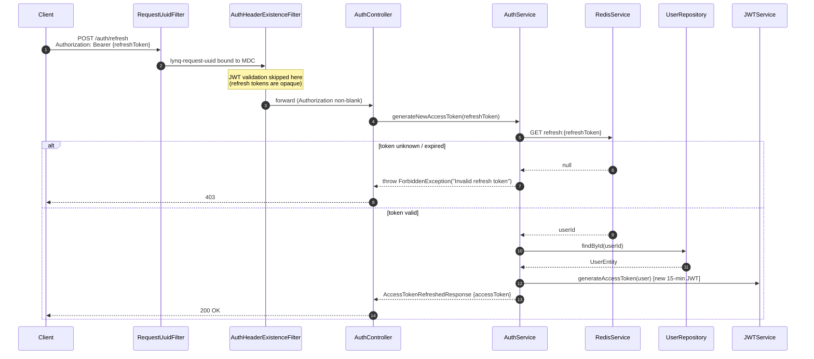

# lynq-iam

[](https://github.com/MatLock/UdeSA-lyqn/actions/workflows/lyqn-test-workflow.yaml)
[](https://github.com/MatLock/UdeSA-lyqn/actions/workflows/lyqn-test-workflow.yaml)

Identity and Access Management service for the Lynq platform. Issues short-lived JWT access tokens and opaque, Redis-backed refresh tokens, and exposes endpoints for registration, login (by username or email), token refresh, token validation, and password update.

---

## Table of contents

- [Technologies](#technologies)
- [Architecture](#architecture)
- [Request lifecycle](#request-lifecycle)
- [Authentication flows](#authentication-flows)
  - [Registration](#1-registration)
  - [Login](#2-login)
  - [Access token refresh](#3-access-token-refresh)
- [API reference](#api-reference)
- [Sample requests](#sample-requests)
- [Running locally](#running-locally)
- [Running with Docker](#running-with-docker)
- [Configuration](#configuration)
- [Observability](#observability)
- [Project layout](#project-layout)

---

## Technologies

| Area              | Stack                                                                 |
| ----------------- | --------------------------------------------------------------------- |
| Language / JDK    | Java 21                                                               |
| Framework         | Spring Boot 4.0.6 (Web, Data JPA, Data Redis, Security, Actuator, AOP) |
| Web server        | Jetty (Tomcat excluded)                                               |
| Persistence       | MySQL 9, Hibernate / Spring Data JPA, Liquibase migrations            |
| Cache / sessions  | Redis 7 (refresh-token store)                                         |
| Security          | JJWT 0.13 (HMAC-SHA signed access tokens), BCrypt password hashing    |
| Validation        | Hibernate Validator, Bean Validation (Jakarta)                        |
| Docs              | springdoc-openapi (Swagger UI)                                        |
| Logging           | Log4j2 + SLF4J MDC for per-request correlation IDs                    |
| Metrics           | Micrometer + Prometheus registry                                      |
| Build             | Maven (Spring Boot plugin), Dockerfile on `eclipse-temurin:21-jre-alpine` |
| Tests             | JUnit Jupiter, Spring Security / Redis test starters                  |

---

## Architecture

```
                            ┌───────────────────────────┐
                            │       Client (HTTP)       │
                            └─────────────┬─────────────┘
                                          │  Authorization, lynq-request-uuid
                                          ▼
                ┌───────────────────────────────────────────────────┐
                │                  Servlet filters                  │
                │   1. RequestUuidFilter        (all routes)        │
                │   2. AuthHeaderExistenceFilter (protected routes) │
                │   3. AuthHeaderValidationFilter (JWT-only routes) │
                └─────────────┬─────────────────────────────────────┘
                              │
                              ▼
                ┌─────────────────────────────────┐
                │       AuthController            │  @RestController, /auth/*
                └─────────────┬───────────────────┘
                              │
                              ▼
                ┌─────────────────────────────────┐
                │           AuthService           │  orchestrates auth use cases
                └──┬─────────────┬────────────────┘
                   │             │              │
                   ▼             ▼              ▼
        ┌────────────────┐ ┌──────────┐ ┌──────────────────┐
        │  UserService / │ │ JWT      │ │  RedisService    │
        │  UserRepo (JPA)│ │ Service  │ │  (refresh tokens)│
        └────────┬───────┘ └────┬─────┘ └────────┬─────────┘
                 ▼              ▼                ▼
            ┌────────┐     ┌────────┐       ┌────────┐
            │ MySQL  │     │ HMAC   │       │ Redis  │
            │ users  │     │ secret │       │ refresh│
            └────────┘     └────────┘       └────────┘
```

**Layers**

- **Controller** (`controller/`) — thin HTTP layer. The interface (`AuthController`) carries OpenAPI annotations; the implementation (`AuthControllerImpl`) maps HTTP verbs to service calls and wraps responses in `GlobalRestResponse<T>`.
- **Service** (`service/`) — business logic. `AuthService` is the orchestrator; `UserService` owns user CRUD; `RedisService` owns the refresh-token store.
- **Security** (`security/`) — `JWTService` signs and verifies access tokens; `RefreshTokenGenerator` produces 64-byte URL-safe opaque tokens.
- **Filters** (`filter/`) — cross-cutting request handling registered via `FilterConfig` with explicit ordering.
- **Aspect** (`aspect/`) — `@AuditLog` annotation + `LogAspect` produce structured entry/exit logs around annotated methods.
- **Model / Repository** (`model/`, `repository/`) — JPA entities and Spring Data interfaces.
- **Exception handling** (`exceptions/`, `controller/handler/`) — domain exceptions mapped to consistent error responses by `ControllerExceptionHandler`.
- **Migrations** (`resources/changelog/`) — Liquibase changelogs run on startup.

---

## Request lifecycle

Every request passes through an ordered filter chain before reaching a controller:

| Order | Filter                       | Scope                                                                          | Purpose                                                                 |
| :---: | ---------------------------- | ------------------------------------------------------------------------------ | ----------------------------------------------------------------------- |
| 0     | `RequestUuidFilter`          | `/*`                                                                           | Require `lynq-request-uuid` header; bind it to SLF4J MDC for log correlation. |
| 1     | `AuthHeaderExistenceFilter`  | `/auth/validate`, `/auth/refresh`, `/auth/update-password`, `/auth/userinfo`   | 401 if `Authorization` is missing or blank.                             |
| 2     | `AuthHeaderValidationFilter` | `/auth/validate`, `/auth/update-password`, `/auth/userinfo`                    | 401 if the bearer JWT is invalid or expired.                            |

`/auth/refresh` deliberately skips JWT validation — the access token may already be expired; the refresh token is validated against Redis inside `AuthService`.

Public routes (`/auth/register`, `/auth/login/username`, `/auth/login/email`) still require `lynq-request-uuid`.

---

## Authentication flows

The three core flows below use Mermaid sequence diagrams (rendered natively by GitHub).

### 1. Registration



### 2. Login

Username and email login are symmetric — only the lookup field differs.



### 3. Access token refresh



> Note: the existing refresh token is **not** rotated — it remains valid until its 30-day Redis TTL expires.

---

## API reference

Base path: `/lynq-iam` (Spring `server.servlet.context-path`).
All requests must include the `lynq-request-uuid` header.

| Method | Path                          | Auth header required | Description                                  |
| ------ | ----------------------------- | -------------------- | -------------------------------------------- |
| POST   | `/auth/register`              | —                    | Create user, return user + access + refresh. |
| POST   | `/auth/login/username`        | —                    | Login by username + password.                |
| POST   | `/auth/login/email`           | —                    | Login by email + password.                   |
| POST   | `/auth/refresh`               | Bearer refresh token | Issue a new 15-min access token.             |
| GET    | `/auth/validate`              | Bearer access token  | Returns `true` if the access token is valid. |
| PATCH  | `/auth/update-password`       | Bearer access token  | Rotate password, return fresh tokens.        |
| GET    | `/auth/userinfo`              | Bearer access token  | Return user identity (id, username, email) extracted from the access token. |

OpenAPI / Swagger UI is exposed at `/lynq-iam/swagger-ui.html` (springdoc default).

Responses are wrapped in `GlobalRestResponse<T>`:

```json
{ "success": true, "data": { ... } }
```

---

## Sample requests

> Substitute `$UUID` with any UUID you generate per request (e.g. `uuidgen`).

**Register**

```bash
curl -X POST http://localhost:8080/lynq-iam/auth/register \
  -H "Content-Type: application/json" \
  -H "lynq-request-uuid: $UUID" \
  -d '{
    "username": "johndoe",
    "password": "P@ssw0rd123",
    "email": "johndoe@example.com"
  }'
```

**Login by username**

```bash
curl -X POST http://localhost:8080/lynq-iam/auth/login/username \
  -H "Content-Type: application/json" \
  -H "lynq-request-uuid: $UUID" \
  -d '{ "username": "johndoe", "password": "P@ssw0rd123" }'
```

**Login by email**

```bash
curl -X POST http://localhost:8080/lynq-iam/auth/login/email \
  -H "Content-Type: application/json" \
  -H "lynq-request-uuid: $UUID" \
  -d '{ "email": "johndoe@example.com", "password": "P@ssw0rd123" }'
```

**Refresh access token**

```bash
curl -X POST http://localhost:8080/lynq-iam/auth/refresh \
  -H "lynq-request-uuid: $UUID" \
  -H "Authorization: Bearer $REFRESH_TOKEN"
```

**Validate access token**

```bash
curl http://localhost:8080/lynq-iam/auth/validate \
  -H "lynq-request-uuid: $UUID" \
  -H "Authorization: Bearer $ACCESS_TOKEN"
```

**Update password**

```bash
curl -X PATCH http://localhost:8080/lynq-iam/auth/update-password \
  -H "Content-Type: application/json" \
  -H "lynq-request-uuid: $UUID" \
  -H "Authorization: Bearer $ACCESS_TOKEN" \
  -d '{ "newPassword": "N3wP@ssw0rd!" }'
```

**Get user info from access token**

```bash
curl http://localhost:8080/lynq-iam/auth/userinfo \
  -H "lynq-request-uuid: $UUID" \
  -H "Authorization: Bearer $ACCESS_TOKEN"
```

Sample success response:

```json
{
  "success": true,
  "data": {
    "id": "0190d1b0-8b3a-7c00-9f01-1b2c3d4e5f60",
    "username": "johndoe",
    "email": "johndoe@example.com"
  }
}
```

**Sample success response (login / register)**

```json
{
  "success": true,
  "data": {
    "id": "0190d1b0-8b3a-7c00-9f01-1b2c3d4e5f60",
    "username": "johndoe",
    "email": "johndoe@example.com",
    "creationDate": "2026-06-02T19:30:00Z",
    "accessToken": "eyJhbGciOiJIUzI1NiJ9...",
    "refreshToken": "Q2hhbm5lbF9yZWZyZXNoX3Rva2VuX2V4YW1wbGU..."
  }
}
```

**Sample error response**

```json
{
  "success": false,
  "data": null,
  "error": "Invalid username or password"
}
```

---

## Running locally

**Prerequisites**

- JDK 21
- Maven 3.9+
- A reachable MySQL 9 (database `lynq_iam_db`) and Redis 7

The default profile in `application.yaml` is preconfigured for `localhost:3306` (MySQL) and `localhost:6379` (Redis) with username `root` / password `password` for MySQL and `root` / `password` for Redis. Override these if your local instances differ.

**Steps**

```bash
# 1. Start MySQL and Redis however you prefer (Homebrew, Docker, etc.)
#    Easiest path: use just the data services from docker-compose:
docker compose up -d mysql redis

# 2. Build and run
./mvnw clean package
java -jar target/lynq-iam.jar

# Or run directly:
./mvnw spring-boot:run
```

Liquibase will create the schema and `users` table on first startup.

Service URLs:
- API: `http://localhost:8080/lynq-iam`
- Actuator / Prometheus: `http://localhost:8081/actuator`
- Swagger UI: `http://localhost:8080/lynq-iam/swagger-ui.html`

---

## Running with Docker

`docker-compose.yaml` provisions the app, MySQL, and Redis together:

```bash
# Build the jar first (the image just COPYs it in)
./mvnw clean package

# Bring everything up
docker compose up --build
```

To override credentials, pass them via env vars or a `.env` file alongside the compose file:

```env
DB_USERNAME=root
DB_PASSWORD=password123
REDIS_USERNAME=
REDIS_PASSWORD=
```

Healthchecks gate startup so `lynq-iam` only boots once MySQL and Redis report healthy.

To stop and wipe data:

```bash
docker compose down -v
```

---

## Configuration

Two profiles ship with the project:

- **`application.yaml`** (default) — local development; hard-coded credentials suitable only for a local machine.
- **`application-production.yaml`** — driven entirely by environment variables:

| Variable          | Used by              |
| ----------------- | -------------------- |
| `DB_URL`          | `spring.datasource.url` (JDBC URL) |
| `DB_USERNAME`     | MySQL user           |
| `DB_PASSWORD`     | MySQL password       |
| `REDIS_ADDRESS`   | Redis host           |
| `REDIS_PORT`      | Redis port           |
| `REDIS_USERNAME`  | Redis ACL username   |
| `REDIS_PASSWORD`  | Redis ACL password   |

Activate the production profile by setting `SPRING_PROFILES_ACTIVE=production`.

**Token configuration** (in `application.yaml` under `lynq.security.jwt`):

- `secret` — HMAC signing key for access tokens.
- `access-token-expiration-minutes` — default `15`.
- `refresh-token-expiration-days` — default `30` (also enforced as the Redis TTL).

---

## Observability

- **Logs** — Log4j2 (`log4j2-spring.xml`). Every entry includes the `requestId` MDC key set by `RequestUuidFilter`, making it trivial to correlate logs for a single request across services.
- **Audit logs** — methods annotated with `@AuditLog` are wrapped by `LogAspect`, which records method entry, arguments (sanitized), and outcome.
- **Health** — `/actuator/health` with `liveness` and `readiness` probes enabled, exposed on the management port (`8081`).
- **Metrics** — `/actuator/prometheus` exports Micrometer metrics in Prometheus format.

---

## Project layout

```
src/
├── main/
│   ├── java/com/lynq/iam/
│   │   ├── LynqIamApplication.java
│   │   ├── aspect/        # @AuditLog + LogAspect
│   │   ├── config/        # App, Security, Redis, Filter beans
│   │   ├── controller/    # AuthController interface + impl, DTOs, error handler
│   │   ├── exceptions/    # Domain exceptions
│   │   ├── filter/        # Request UUID + auth header filters
│   │   ├── model/         # JPA entities
│   │   ├── repository/    # Spring Data repositories
│   │   ├── security/      # JWTService, RefreshTokenGenerator
│   │   └── service/       # AuthService, UserService, RedisService
│   └── resources/
│       ├── application.yaml
│       ├── application-production.yaml
│       ├── log4j2-spring.xml
│       └── changelog/     # Liquibase DDL
└── test/
    └── java/com/lynq/iam # JUnit tests
```